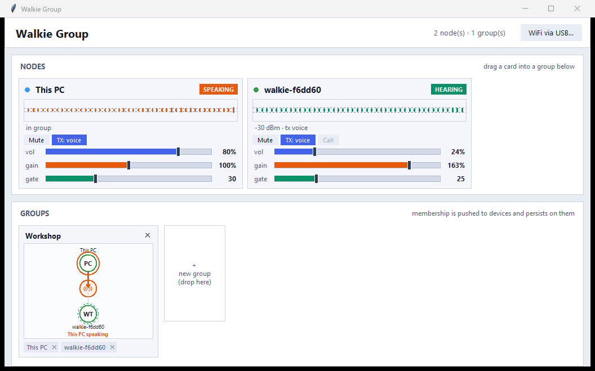
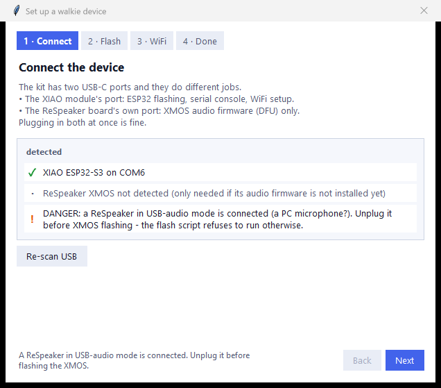
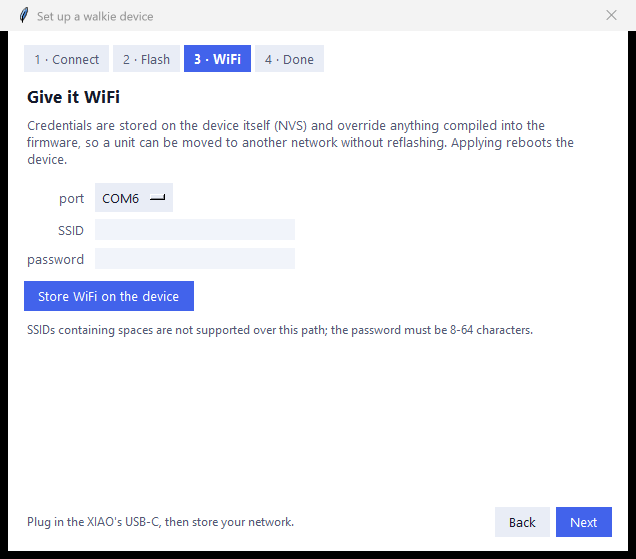

# ReSpeaker Lite IP Walkie-Talkie

Full-duplex WiFi intercom and **group chat** for
[Seeed ReSpeaker Lite](https://www.seeedstudio.com/ReSpeaker-Lite-p-5928.html)
kits with a XIAO ESP32-S3 — plus a PC client that joins as an equal node.

Audio is captured through the XMOS XU316 front-end (AEC / noise suppression /
AGC — this is what makes open-speaker full duplex possible), compressed with
**Opus** at 48 kHz, and streamed peer-to-peer on the local network. There is
no server and no cloud. Units discover each other via mDNS and presence
broadcasts, and each device **remembers its own configuration** — WiFi, volume,
mic gain, TX mode and group membership all live in the device's NVS and
survive reboots.



---

## What you can do

- **Talk between two or more ReSpeaker units** over WiFi, hands-free.
- **Use your PC as another walkie** — same protocol, same group.
- **Group chat**: drag nodes into groups; a node can be in several groups.
  One speaker holds the floor at a time.
- **See who is talking, live** — per-node waveforms, SPEAKING / ON AIR /
  HEARING / MUTED badges, and a broadcast graph per group.
- **Tune each node remotely**: speaker volume, mic gain, voice-activation
  gate, mute, and always-on vs voice-activated transmission.
- **Set up a new unit from the GUI** — a wizard detects the hardware, flashes
  both processors with live log output, and provisions WiFi over USB. No
  credentials baked into the firmware image.

---

## Hardware

- 1 or more ReSpeaker Lite kits with XIAO ESP32-S3 pre-soldered
- A speaker per unit (JST connector or the 3.5 mm jack)
- USB-C power

Two different USB-C ports matter: the **XIAO's** port is for ESP32 flashing,
the serial console and USB provisioning; the **ReSpeaker board's** own port is
for XMOS DFU firmware only.

The XMOS must run the **48 kHz I2S** firmware. The flash script checks this
and upgrades it automatically.

Seeed documentation:
[Getting Started with reSpeaker Lite](https://wiki.seeedstudio.com/reSpeaker_usb_v3/) ·
[ReSpeaker Lite + XIAO ESP32S3 kit](https://wiki.seeedstudio.com/xiao_respeaker/) ·
[XMOS firmware repository](https://github.com/respeaker/ReSpeaker_Lite) ·
[product page](https://www.seeedstudio.com/ReSpeaker-Lite-p-5928.html)

---

## Quick start

### 1. Install the PC client

```powershell
cd pc_client
python -m venv .venv
.venv\Scripts\pip install -r requirements.txt
.venv\Scripts\python walkie_gui.py
```

### 2. Run the setup wizard

Click **Set up new device…** in the header. The wizard walks a brand-new unit
from bare board to a node on your network, and it detects what is actually
plugged in as you go.



**Step 1 · Connect** — explains the two USB-C ports and shows what it found:
the XIAO's COM port, whether the ReSpeaker's XMOS is in DFU mode and which
firmware revision it reports, and — importantly — whether a ReSpeaker in
**USB-audio mode** (a PC microphone) is attached.

**Step 2 · Flash** — runs `tools/flash_all.ps1` with its output streamed live
into the window. Choose *Flash both*, *ESP32 only*, or *XMOS only*; **Stop**
cancels. The XMOS step is skipped automatically when its firmware is already
the 48 kHz I2S build (rev `0110`). Requires
[ESP-IDF v5.4](https://docs.espressif.com/projects/esp-idf/en/v5.4/esp32s3/get-started/);
the first ESP32 build takes a few minutes. On the first XMOS flash per PC,
Zadig opens for the one-time WinUSB driver install (select *ReSpeaker Lite* →
*Install Driver*).

> ⚠️ If you own a second ReSpeaker used as a USB microphone, unplug it before
> XMOS flashing. Both the wizard and the flash script refuse to run
> `dfu-util` while one is connected, so the wrong device cannot be targeted.
> *ESP32 only* stays available, since it never invokes `dfu-util`.

**Step 3 · WiFi** — credentials are **not** baked into the firmware image.
Pick the COM port, enter SSID and password, and store them on the device.



They go into the device's NVS, **override anything compiled in**, and survive
reflashing — so a unit can be moved to another network without rebuilding.
The device reboots onto your network.

**Step 4 · Done** — watches for the unit to appear on the network and lists
what is online. Each unit identifies itself by a MAC-derived hostname like
`walkie-f6dd60`. Repeat for each device, then drag the new node into a group.

*Command line alternative:* `powershell -ExecutionPolicy Bypass -File
tools\flash_all.ps1` (flags: `-EspOnly`, `-XmosOnly`, `-Port COMx`,
`-Monitor`). Copying `wifi.conf.example` → `wifi.conf` at the repo root bakes
credentials in as a fallback; anything stored over USB takes priority.

---

## Using the GUI

The window has two halves: **nodes** on top, **groups** below.

### Node cards

Each node — every walkie plus *This PC* — gets a card with:

| Element | Meaning |
|---|---|
| Status dot | grey offline · blue idle · green linked · purple muted |
| Waveform | live mic level; the dashed line is the voice gate |
| Badge | **SPEAKING** (voice detected) · **ON AIR** (transmitting, no voice) · **HEARING** · **MUTED** |
| **Mute** | toggles that node's mic (devices too, remotely) |
| **TX: always / voice** | transmit continuously, or only when speaking |
| **Call** | direct 1:1 TCP call between this PC and that device |
| `vol` | speaker volume, 0–100 % |
| `gain` | mic gain, 0–200 % — scales the waveform, the gate and what is sent |
| `gate` | voice-activation threshold; higher = louder speech required |
| **AGC** | *(devices)* auto gain + noise gate; shows the live boost, e.g. `AGC ×5.8` |

**Too quiet, too noisy, or both?** Turn on **AGC**. Plain `gain` multiplies
voice and hiss equally, so it cannot fix both at once. AGC learns the room's
noise floor, boosts only what stands above it (up to ×12, converging on a
consistent level so quiet and loud talkers arrive alike), and ducks
noise-only stretches by about 18 dB — with a 300 ms hold so syllable gaps
don't chatter. It is stored on the device and survives reboots.

**Tuning voice mode:** switch TX to *voice*, then watch your own waveform
while talking — set `gate` so speech crosses the dashed line and room noise
does not. Raise `gain` first if the waveform barely moves.

### Groups

Drag a node card into a group box, or onto **+ new group** to start one. A
node may belong to several groups. Double-click a group's name to rename it,
`✕` on a chip to remove that member, `✕` in the header to delete the group.

Each group draws a live hub-and-spoke graph: an orange arrow into the hub
marks whoever is broadcasting, amber marks a node transmitting without voice,
a dashed green ring marks a node that is hearing audio.

Membership is pushed to the devices and stored in their NVS, so
**device-to-device groups keep working after you close the GUI**. The GUI
re-asserts the layout every few seconds, so a unit that reboots rejoins on its
own. A device can hold up to 8 members.

### Echo

Your PC has no echo canceller (the ReSpeakers do, in the XMOS). Either use
headphones, or set the PC to **TX: voice** so it stops transmitting while the
far end is talking.

---

## Headless client

```powershell
.venv\Scripts\python walkie_pc.py            # discover via mDNS
.venv\Scripts\python walkie_pc.py --ip 192.168.1.42
```

---

## LED states

| Colour | Meaning |
|---|---|
| Orange | Connecting to WiFi |
| Blue | On WiFi, no peer |
| Green | Linked |
| Purple | Mic muted |

The board's round **MUTE** button is handled by the XMOS in hardware. The
**USER** button (GPIO3) toggles software mute; mute always resets to *live*
on boot.

---

## How it works, briefly

```
mics → XU316 (AEC/NS/AGC) → I2S → ESP32-S3 → gain → VOX gate → Opus encode
     → UDP 5004 (groups) / TCP 5010 (PC call) ⇄ → jitter buffer
     → Opus decode → volume → I2S → XU316 → speaker
```

Opus 48 kHz mono, 20 ms frames, 24 kbps VOIP mode with in-band FEC. The
jitter buffer prefills ~60 ms, recovers losses from FEC, conceals the rest,
and drops a frame when it creeps up to absorb clock drift. Mouth-to-ear
latency is roughly 100 ms on a healthy LAN.

Full details — protocol reference, state storage, VOX curves, tuning
constants — are in **[docs/technical_spec.md](docs/technical_spec.md)**.

---

## Repository layout

| Path | Contents |
|---|---|
| `main/` | ESP-IDF firmware (audio, codec, jitter buffer, network, console, LED) |
| `pc_client/` | `walkie_gui.py` (GUI) and `walkie_pc.py` (client library + CLI) |
| `tools/` | `flash_all.ps1`, XMOS firmware, Zadig |
| `docs/` | [technical spec](docs/technical_spec.md), [debug guide](docs/debug_guide.md) |

Working on this repo with an AI assistant? Point it at
[docs/debug_guide.md](docs/debug_guide.md) — hardware access, flashing and
debugging procedures, including the pitfalls that cost real time.

---

## Troubleshooting

| Symptom | Cause / fix |
|---|---|
| Device never appears | Check WiFi credentials via USB console (`info`); LED orange = still connecting |
| `esptool` "Write timeout" | COM port wedged — unplug and replug the XIAO cable |
| Choppy audio | Raise `WT_JB_PREFILL` (latency ↑, robustness ↑) |
| "encode overrun" in the log | Lower Opus complexity in `menuconfig` |
| PC group audio goes quiet | Some routers blackhole UDP flows — re-apply the group to get a fresh socket |
| Constant transmission | That node is in **TX: always**; switch it to **voice** |
