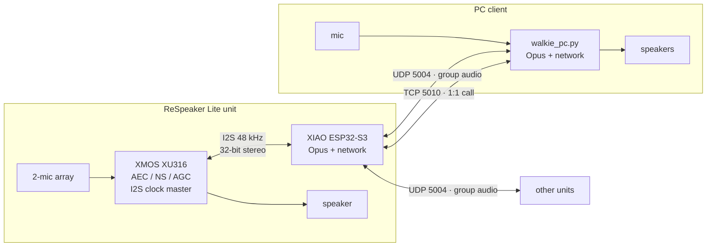
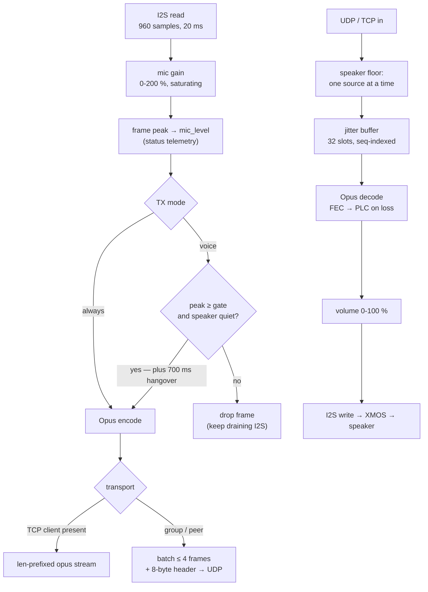
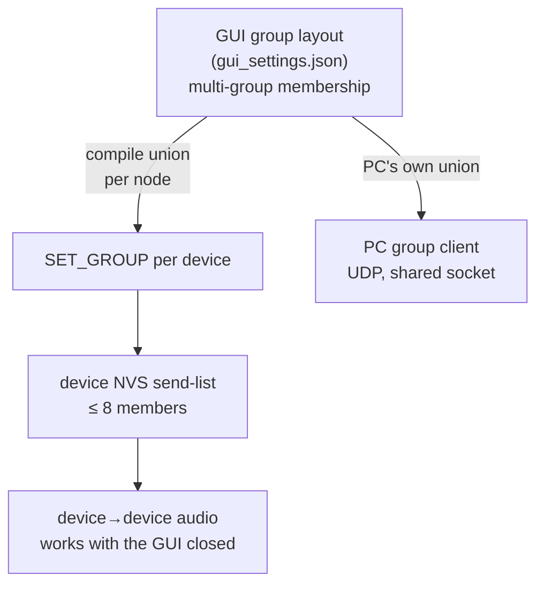

# Technical Specification

Reference for the ReSpeaker Lite IP walkie-talkie: architecture, audio
pipeline, wire protocol, and where every setting is stored.

Companion documents:
[README](../README.md) (overview and usage) ·
[debug_guide.md](debug_guide.md) (hardware access, flashing, debugging).

---

## 1. System architecture

Every participant is a **node**: a ReSpeaker Lite unit or a PC running the
Python client. Nodes are peers — there is no server, no cloud, and no
central mixer. A node keeps a **send-list** (whom it transmits to) and
plays back whatever arrives.



**Why the XMOS matters.** The XU316 runs acoustic echo cancellation, noise
suppression and AGC *before* the ESP32 sees the signal, and everything the
ESP32 plays is written back through the XMOS — so the echo canceller always
has the far-end reference. That is what makes open-speaker, full-duplex
operation possible. The PC side has no AEC, which is why the PC client
offers a voice-activated TX mode (see §4).

### Firmware tasks

| Task | Core | Prio | Stack | Role |
|---|---|---|---|---|
| `capture` | 1 | 10 | 48 KB | I2S read → gain → VOX gate → Opus encode → send |
| `playback` | 1 | 10 | 48 KB | jitter buffer → Opus decode → volume → I2S write |
| `udp_rx` | 0 | 9 | 6 KB | UDP audio + control requests |
| `tcp_srv` | 0 | 9 | 6 KB | TCP 5010 listener (PC calls) |
| `console` | 0 | 5 | 4 KB | USB serial config console |
| `app_main` | — | — | — | button, LED, keepalives, discovery, reconcile |

Audio tasks need 48 KB: libopus is stack-hungry and 24 KB overflowed inside
`opus_encode` the moment a call started.

---

## 2. Audio pipeline

Format is dictated by the XMOS 48 kHz I2S firmware: **48 kHz, 32-bit slots,
stereo, XMOS is clock master, ESP32 is slave**. Channel 0 carries the
processed (ASR) mic signal; samples are MSB-aligned, so converting to
`int16` is a `>> 16`.



**Codec.** Opus, 48 kHz mono, 20 ms frames (960 samples), VOIP mode,
24 kbps, complexity 3, bandwidth capped at wideband (SILK then runs at
16 kHz internally, keeping encode cost low), in-band FEC at 10 % expected
loss, **DTX off**. DTX was disabled deliberately: it suppressed real speech
after AGC convergence, so the far end heard nothing.

**Jitter buffer.** 32 slots indexed by sequence number. Playback starts
after 3 frames (~60 ms) are buffered. A missing frame is first recovered
from the *next* packet's FEC data, otherwise concealed (PLC). Above 8
buffered frames one extra frame is consumed to re-center latency — the two
ends' 48 kHz crystals drift. After ~25 consecutive losses (~0.5 s) the
buffer resets and re-prefills.

**Latency.** Roughly 100 ms mouth-to-ear on a healthy LAN: 20 ms frame +
~60 ms prefill + network and DMA.

**One speaker at a time.** Group audio is not mixed. A source owns playback
until it has been silent for 400 ms, after which another may take the floor.
Sequence spaces are per-source and unrelated, so interleaving two senders
would garble the buffer — the loser's frames are dropped, not queued. The PC
client implements the same rule.

---

## 3. Wire protocol

Magic `WTK1` (`0x314B5457`), protocol version 2.

### Transports

| Path | Transport | Port | Format |
|---|---|---|---|
| PC ↔ device, 1:1 call | TCP | 5010 | `[u16 len][opus]`, len 0 = heartbeat |
| Group audio, device ↔ device | UDP | 5004 | header + batched `[u16 len][opus]` |
| Control | UDP | 5004 | header with `WT_FLAG_CTRL` |
| Presence / discovery | UDP broadcast | 5004 | 8-byte header, every 2 s |

TCP exists because the development router forwards TCP perfectly while
randomly blackholing individual UDP flows. On accept, the device sends an
identity banner frame whose payload starts with ASCII `WTKI` — **clients
must not decode it as audio**. While a TCP client is connected, incoming
UDP audio is *not* inserted into the jitter buffer: TCP wins.

### Header (8 bytes, little-endian)

```c
typedef struct __attribute__((packed)) {
    uint32_t magic;    // 0x314B5457
    uint16_t seq;      // sequence of the FIRST frame in the datagram
    uint8_t  flags;    // 0x01 audio, 0x02 control; 0 = keepalive
    uint8_t  version;  // 2
} wt_header_t;
```

Audio datagrams carry up to 4 consecutive 20 ms frames, each prefixed with
a little-endian `u16` length. Batching keeps the packet rate low — consumer
routers' flood protection can blacklist a 50 pps stream of tiny datagrams.

### Control commands

Control never influences peer adoption, so monitoring is always safe. Every
request is answered with a `wt_status_t`.

| Cmd | Name | Body | Persisted |
|---|---|---|---|
| `0x01` | `STATUS_REQ` | — | — |
| `0x02` | `STATUS_RSP` | `wt_status_t` | — |
| `0x03` | `SET_PEER` | `u8 cmd, u8 rsv, u16 port, u32 ip` (ip 0 = auto) | yes |
| `0x04` | `SET_VOL` | `u8` speaker volume 0–100 | yes |
| `0x05` | `SET_MODE` | `u8` 0 = always TX, 1 = voice (VOX) | yes |
| `0x06` | `SET_MUTE` | `u8` 0/1 | **no** (boots unmuted) |
| `0x07` | `SET_GROUP` | `u8 count` + count × `{u32 ip, u16 port}` | yes |
| `0x08` | `SET_THRESH` | `u8` VOX gate 0–100 | yes |
| `0x09` | `SET_GAIN` | `u8` mic gain 0–200 % | yes |
| `0x0A` | `SET_AGC` | `u8` 0/1 auto gain + noise gate | yes |

### Status reply

Fields after `hostname` are **appended extensions** — parse by payload
length so older/newer peers interoperate.

```c
typedef struct __attribute__((packed)) {
    uint8_t  cmd, proto, muted, linked, peer_locked;
    int8_t   rssi;
    uint16_t peer_port;        // network order
    uint32_t peer_ip;          // network order
    char     hostname[24];
    // --- optional extensions ---
    uint8_t  volume;           // 0-100
    uint8_t  tx_mode;          // 0 always, 1 voice
    uint8_t  tx_active;        // transmitting right now
    uint8_t  rx_active;        // playing far-end audio right now
    uint8_t  member_count;
    wt_member_t members[8];    // {u32 ip, u16 port}
    uint8_t  mic_level;        // latest frame peak >> 7
    uint8_t  vox_thresh;       // 0-100
    uint8_t  mic_gain;         // 0-200 %
    uint8_t  mic_agc;          // auto gain + noise gate on
    uint8_t  agc_gain;         // gain the AGC currently applies, 1/16 steps
} wt_status_t;
```

---

## 4. Voice-activated transmission (VOX)

In **always** mode a node transmits every frame. In **voice** mode it
transmits only while it hears speech *and* its own speaker is quiet, which
prevents a speaker→mic loop on hardware without echo cancellation.

The 0–100 gate knob maps quadratically, so the useful low range is not
crammed into a few pixels:

| | mapping | gate 0 | gate 30 (default) | gate 60 | gate 100 |
|---|---|---|---|---|---|
| Device (frame peak) | `150 + gate² × 2` | 150 | 1 950 | 7 350 | 20 150 |
| PC client (RMS) | `20 + gate² × 0.3` | 20 | 290 | 1 100 | 3 020 |

Reference levels: post-AGC speech peaks ~10 000–30 000; a quiet room is a
few hundred. On the PC, speech is typically RMS 500–3 000, a quiet room
under ~100.

Timing: TX stays open 700 ms after the last voiced frame (so words are not
chopped), and local speech cannot open the gate within 400 ms of far-end
audio playing.

**Mic gain is applied first**, before level reporting, gating and encoding —
so one number scales the waveform you see, the gate's input, and the audio
actually sent. Gain therefore also shifts where the gate effectively opens.
Gain saturates rather than wraps, so clipping degrades gracefully.

Gain is applied to the **32-bit I2S slot before the narrowing to int16**
(`audio_capture(mono, g0, g1)`), and ramps linearly across the frame. Scaling
after the truncation — as this code used to — amplified truncation noise
along with the signal and made every AGC/gate move click.

### Auto gain + noise gate (`SET_AGC`)

Flat digital gain raises voice and hiss equally, so it cannot fix "too quiet
*and* too noisy". This mode instead learns the room and treats the two
differently:

- **Noise floor by minimum statistics.** The quietest frame in each 1.5 s
  window sets the floor (`WT_NF_WINDOW`, smoothed by `WT_NF_SMOOTH`).
- **Voiced** = `peak > floor × 3 + 60`.
- **Gain adapts on voiced frames only**, converging on
  `WT_AGC_TARGET_PEAK` (20 000), clamped to ×0.5–×12, fast to come down
  (`WT_AGC_ATTACK`) and slow to go up (`WT_AGC_RELEASE`) so it never pumps.
- **Everything else is ducked** to `WT_NR_ATTEN` (≈ −18 dB), after a
  300 ms hold (`WT_NR_HOLD_FRAMES`) so syllable gaps do not chatter.

Two feedback traps this design deliberately avoids, both of which deadlock:

1. **Gate decisions must not read the ducked output.** They use the frame's
   *pre-gain* peak (scaled by manual gain only). Reading the output back
   would mean a closed gate keeps the first word attenuated, so the gate
   could never reopen.
2. **The noise floor must not depend on the speech decision.** Freezing the
   floor during "speech" lets steady room tone read as speech forever;
   letting it rise during speech lets a sustained quiet talker be absorbed
   into the floor. A rolling minimum needs no classification and does
   neither.

The AGC is also independent of the VOX transmit threshold — tying them
together meant a quiet room gated the AGC off entirely, which is exactly
when a quiet talker needs the boost most.

Simulated against syllable-modulated speech over a steady room tone: a quiet
room is never misread as speech, quiet and loud speech are detected 86 % and
100 % of frames, output speech-to-noise improves from 5× to ~37×, and quiet
versus loud speech land within about 2× of each other instead of 6×.

---

## 5. Group routing

A group is a GUI concept; a device only stores the flat list of nodes it
sends to.



- The GUI derives each device's send-list as the **union of everyone it
  shares a group with**, then pushes it with `SET_GROUP`.
- A reconciler re-asserts the layout every 4 s, so devices that reboot or
  appear late converge automatically. Devices in no GUI group are never
  touched.
- **Limit: 8 members per device** (`WT_MAX_MEMBERS`). The GUI warns when a
  union is clipped.
- At startup, if the GUI has no groups of its own, it **imports** them by
  reading device member lists and reconstructing connected components.
  A flat union cannot encode overlapping groups, so imports appear merged.
- On exit the GUI removes only *this PC* from device lists; device↔device
  routing is deliberately left running.

---

## 6. Persistent state

### On the device — NVS namespace `walkie`

| Key | Meaning | Set by |
|---|---|---|
| `wifi_ssid`, `wifi_pass` | WiFi credentials; **override the compiled-in values** | USB console |
| `spk_vol` | speaker volume 0–100 | `SET_VOL` |
| `tx_mode` | 0 always / 1 voice | `SET_MODE` |
| `vox_th` | VOX gate 0–100 | `SET_THRESH` |
| `mic_gain` | mic gain 0–200 % | `SET_GAIN` |
| `mic_agc` | auto gain + noise gate on/off | `SET_AGC` |
| `members` | group send-list blob | `SET_GROUP` |
| `peer_ip`, `peer_port` | manual 1:1 pairing | `SET_PEER` |

Volume writes are debounced ~1 s: flash writes briefly stall the other
core's cache, so a slider drag must not write on every tick.

**Mute is intentionally not persisted** — a unit always boots live.

### On the PC — `pc_client/gui_settings.json` (gitignored)

Group layout and names, PC volume / gain / gate, and PC TX mode. The PC is
not a flashed device, so its settings live here.

### Boot order

`console_start()` runs **before** `net_wifi_start()`, so a factory-fresh
unit with no credentials is configurable over USB while WiFi is still
searching.

---

## 7. USB config console

Line-based, on the XIAO's USB serial port (same COM port as the logs,
115200). Replies are single lines prefixed `WTCFG` and may interleave with
log output, so match per line.

The GUI's setup wizard (**Set up new device…**) drives this console for
provisioning. It also shells out to `tools/flash_all.ps1` with the output
streamed into the window, and probes USB directly: `pyserial` for the XIAO
(VID `0x303A`), and a PowerShell `Get-PnpDevice` query for the XMOS. A
walkie's XMOS in I2S mode is a *pure DFU-class* device — a device node
without `&MI_` whose CompatibleIds contain `Class_FE`. That last check is
what distinguishes it from a ReSpeaker running USB-audio firmware, whose
composite *parent* node also lacks `&MI_`. When such a USB-audio unit is
present the wizard refuses XMOS flashing (ESP32-only stays available, since
it never invokes `dfu-util`), mirroring the guard in the flash script.

| Command | Effect |
|---|---|
| `info` | `WTCFG INFO host=… ssid=… build=…` |
| `wifi <ssid> <password>` | store credentials in NVS, reply, reboot |
| `reboot` | restart |

SSIDs containing spaces are not supported over this path; passwords must be
8–64 characters. The driver is installed in non-blocking mode so an unread
port can never stall logging.

---

## 8. Constants and tuning

| Constant | Value | Meaning |
|---|---|---|
| `WT_SAMPLE_RATE` | 48 000 | dictated by XMOS I2S firmware |
| `WT_FRAME_SAMPLES` | 960 | 20 ms |
| `WT_MAX_PAYLOAD` | 400 | largest expected Opus frame |
| `WT_FRAMES_PER_PKT` | 3 (max 4) | frames batched per datagram |
| `WT_JB_PREFILL` | 3 | ~60 ms before playback starts |
| `WT_JB_HIGH_WM` | 8 | drop above this to re-center drift |
| `WT_LOSS_RESET` | 25 | ~0.5 s of loss → re-buffer |
| `WT_SPK_LOCK_US` | 400 ms | speaker floor hold |
| `WT_VOX_TX_HANG_US` | 700 ms | TX hangover |
| `WT_VOX_RX_BLOCK_US` | 400 ms | far-end priority window |
| `WT_KEEPALIVE_US` | 1 s | unicast keepalive |
| `WT_PEER_TIMEOUT_US` | 10 s | auto-peer expiry |

Build-time options (`idf.py menuconfig` → Walkie-Talkie Configuration):
Opus bitrate (default 24 kbps), complexity (default 3), UDP port
(default 5004), optional static peer IP.

Other invariants worth preserving:

- **WiFi power save disabled** (`WIFI_PS_NONE`) — modem sleep caused
  100–300 ms dropouts.
- **`CONFIG_LWIP_TCP_MSL=6000`** — the default 60 s MSL parks every closed
  connection in TIME_WAIT for 2 minutes and exhausts the small PCB pool
  during reconnect churn.
- **I2S `auto_clear = true`** — on TX underrun, play silence instead of
  looping the last DMA buffer (which sounds like buzzing).
- **Device socket `SNDTIMEO` 2 s** — WiFi retry bursts stall sends for
  hundreds of ms; a 200 ms timeout tore down healthy calls.
- `tcp_send_frame` is called from two tasks; its static buffer must stay
  guarded by `s_tcp_tx_lock`, with the `memcpy` inside the lock.

---

## 9. Hardware reference

Pinout is fixed by the kit wiring:

| Signal | GPIO |
|---|---|
| I2S BCLK | 8 |
| I2S LRCLK / WS | 7 |
| Mic data (XMOS → ESP) | 44 |
| Speaker data (ESP → XMOS) | 43 |
| WS2812 LED | 1 |
| USER button | 3 |

LED: orange = connecting to WiFi, blue = no peer, green = linked,
purple = muted.

Partition table: 24 KB NVS at `0x9000`, 3 MB factory app at `0x10000`
(8 MB flash, 8 MB octal PSRAM, 240 MHz).

The XMOS must run the **48 kHz I2S** firmware (USB revision `0110`); the
factory 16 kHz build (`0108`) will not work. `tools/flash_all.ps1` checks
this and reflashes when needed.
